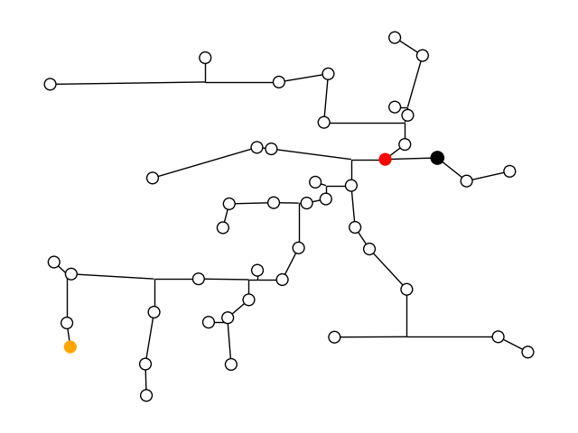
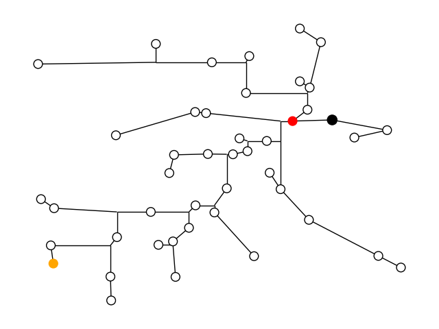
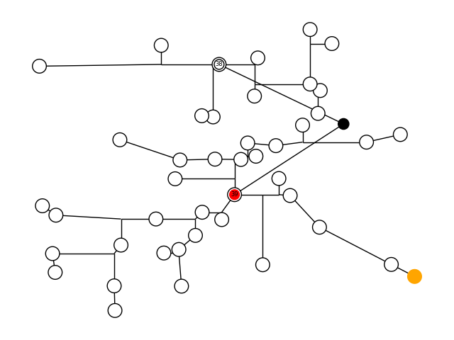
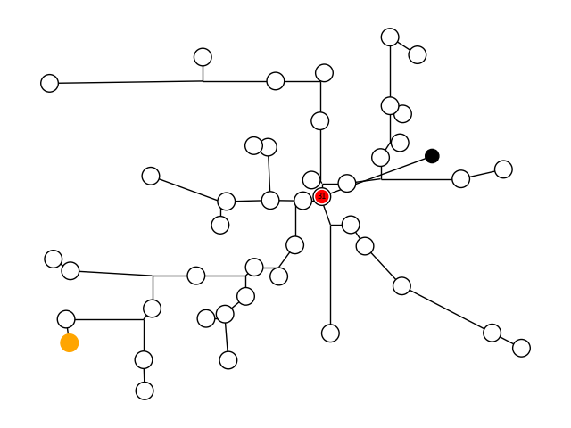
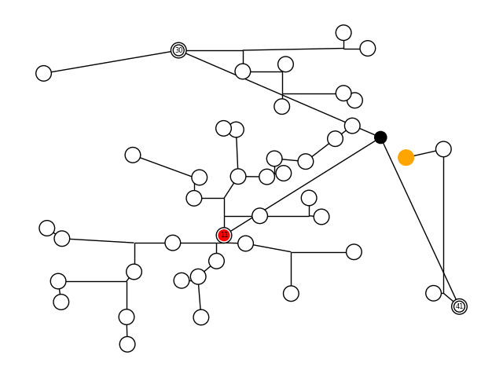
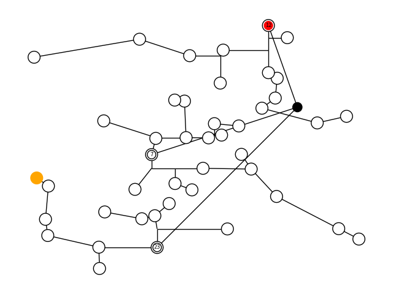

# Multi-Source Prim-Dijkstra Contest  

- **Registration Starts**: April 5th, 2023  
- **Registration Ends**: May 5th, 2023  
- **Contest (Submission Period) Starts**: May 10th, 2023    
- **Progress Prizes Awarded**: September 12th, 2023    
- **Contest Ends**: November 10th, 2023      
- **Final Prizes Awarded**: November 15th, 2023  
- **GitHub Site**: https://github.com/TILOS-AI-Institute/Multi-Source-Prim-Dijkstra  
- **Paper Reference**: [https://vlsicad.ucsd.edu/Publications/Conferences/397/c397.pdf](https://vlsicad.ucsd.edu/Publications/Conferences/397/c397.pdf)
- **Email**: shreyasthumathy@gmail.com, mwoo@ucsd.edu, abk@ucsd.edu

# Table of Contents
- [Overview](#Overview)
- [Prizes](#Prizes)
- [Registration Details](#Registration-Details)
- [Evaluation](#Evaluation)
- [Allowed Interfaces](#Allowed-Interfaces)
- [Input/Output](#InputOutput)
- [Testcases](#Testcases)  
- [CSV Column Details](#CSV-Column-Details)
- [FAQs](#FAQs) 
- [References](#References)  


## Overview  
A routing tree consists of $N$ vertices, with one of these vertices designated as the root, and $N - 1$ directed edges.   
In VLSI, algorithms have traditionally focused on taking the $N$ vertices as the input and returning a routing tree that optimizes between *wirelength* (also known as cost) and *pathlength*.   
Wirelength is the sum of the edge lengths in our routing tree, where edge lengths are determined by the **Manhattan distance** between two vertices in a routing tree. Pathlength is the length of the longest path starting at the root.   
Such algorithms that optimize on wirelength and pathlength include Prim-Dijkstra (PD) [2], which uses the $\alpha$ parameter to construct trees, and SALT [3], which uses the $\epsilon$ parameter to construct trees. More recent works such as TreeNet [4] emphasize the use case of machine learning to effectively identify which construction is best based on the input net.

*Skew*, the maximum difference in source-to-sink pathlengths in a (rooted, with the source terminal being the root) tree, is also an important metric for routing trees.   
The ISQED-2023 paper [1] introduces a *multi-source Prim-Dijkstra* (MSPD) approach to improve cost-skew tradeoffs achievable using an existing Prim-Dijkstra Steiner routing tree implementation.  

This contest focuses on predicting a high-quality multi-source combination to use in the MSPD construction, for any given pointset with identified root.
 
## Prizes    
***Final Prizes***  
*First Place: $2,500    
Second Place: $1,500     
Third Place: $1,000   
Fourth and Fifth Place: $500*     

***Progress Prizes***  
First Place: $700     
Second Place: $400   
Third Place: $250    
Fourth and Fifth Place: $125  

Progress Prizes will be awarded to the top 5 teams according to the contest leaderboard as of September 10th, 2023 11:59 PM PST.  

*Notes on prizes*:  
(1) Recipients of TILOS project funding within the 12 months preceding the contest submission date are not eligible for an Award.   
(2) Applicable taxes may be assessed on and deducted from Award payments, subject to UC San Diego and U.S. government policies.   
(3) 40% of each Final Prize is awarded for performance in the contest according to the defined evaluation metric. The remaining 60% is awarded if the contestant publishes their winning software as open source under a permissive open-source license (BSD, MIT, Apache), within 30 days of being announced as a winner.  
  

## Registration Details
**Registration**:  
PLEASE REGISTER USING THE FOLLOWING [**LINK**](https://forms.gle/X7vkuCNNEwWDy1wY6) !!  
You will be asked for your full name, affiliation, email, and teammates (if any).  
You will receive an email the week before the contest starts confirming your registration.   
The email will also contain information regarding program submission.    


## Evaluation 
**Goal**:  
Develop models to predict a set of 1-3 sources that will yield a Multi-Source Prim-Dijkstra (MSPD) routing tree with best-possible cost-skew tradeoff in the output Steiner tree.  The Steiner tree will be constructed using MSPD with the STT mode. The contest defines three cost-skew tradeoff objectives (corresponding to evaluation metrics, and models used in inference) for which contestants' performance is weighted equally in the scoring.

The input for a trained model will be a series of input nets, where a single net consists of N vertices where the first vertex is the root. 

The output will be a set of 1-3 sources to use for MSPD construction. Please see Section IV of the [ISQED-2023](https://vlsicad.ucsd.edu/Publications/Conferences/397/c397.pdf) paper for more details about what a source is. 


***You must submit three separate models, respectively corresponding to the three distinct optimization objectives***:   
(1) a model to minimize $W'_T + S'_T$,  
(2) a model to minimize $3W'_T + S'_T$, and
(3) a model to minimize $W'_T + 3S'_T$.  
$W'_T$ and $S'_T$ respectively denote the normalized wirelength (normalized to the wirelength of the minimum spanning tree for the input) and normalized skew (normalized to the skew of the shortest-paths tree for the input) for the MSPD Steiner routing tree that results from the use of the model’s identified source(s).   

**Evaluation Metric**:    
Your model will be evaluated on 300 **visible** (public) testcases and 200 **hidden** testcases for each input net size $N = \{10, 15, 25, 30, 40, 45, 50\}$.   
Your model will be evaluated based on the following *evaluation metric* (EM):    
 

$$EM = EM_{open} + 2 * EM_{hidden}$$

$$EM_{m} =  \sum_{n \in N} k_{n} * \sum_{p \in OBJ} MSE (X_{p,m}, Y_{p,m}) $$

where $OBJ = \lbrace W'\_T + S'\_T, 3W'\_T + S'\_T, W'\_T + 3S'\_T  \rbrace$

$N = \{10, 15, 25, 30, 40, 45, 50\}$, 

$X_{p,m}$ and $Y_{p,m}$ are 1D vectors, and $m = \lbrace Open, Hidden \rbrace$.

The vectors $X_{p,m}$ and $Y_{p,m}$ have a size of 300 for $m=open$, and $200$ for $m=hidden$.  
$X_{p,m} = (predictedVal_{p,m,1}/bestCostVal_{p,m,1}, predictedVal_{p,m,2}/bestCostVal_{p,m,2}, ...)$, $Y_{p,m} = (1,1,...,1)$, 

where $predictedVal_{p,m,s}$ is the predicted value of $s$-th net under objective $p$, mode $m$ from your machine learning model,
$bestCostVal_{p,m,s}$ is the best known objective value of $s$-th net under objective $p$, mode $m$ from our database (data_obj_stt_*.csv.gz), 

$MSE(a, b)$ is the mean squared error between the two 1D vectors $a$ and $b$.

$k_{n} = 1$ for $n \in \lbrace 10, 15, 25, 30 \rbrace$ and 
$k_{n} = 2$ for $n \in \lbrace 40, 45, 50 \rbrace$.


Please check the [inference.py](inference.py#L112-L133) to see $EM_{open}$ in detail.

In this contest, your task is to develop efficient ML models to predict a set of sources that minimizes the evaluation metric, using less than 10 seconds of (user) CPU time per instance (i.e., pointset with an identified root), measured on the contest evaluation platform.  
$X_{p,m}$ will be set as 1.5 if your model exceeded runtime limit.
The grader will find the best cost ($W'\_T + S'\_T$, $3W'\_T + S\_T$, or $W'\_T + 3S'\_T$ depending on the model being tested) for the program-generated sources across all $\alpha = \{0, 0.1, 0.2, ..., 1.0\}$.      
The evaluation metric result is derived by comparing the found cost to the best MSPD tree cost and will be reported.     
The lower the evaluation metric result, the better the model is.    
The overall rank of a contestant will be determined by the sum of the average evaluation metric values achieved by the contestant's three models.  


**Example**:  
We will refer to the 300th pointset in the visible $N = 45$ [testcases](https://github.com/TILOS-AI-Institute/Multi-Source-Prim-Dijkstra/blob/main/contest/testcases/input_stt_45.csv.gz).  

The trees below display the best Steiner PD trees for $W'\_T + S'\_T$, $3W'\_T + S'\_T$, and $W'\_T + 3S'\_T$ respectively.  
The costs are $2.00$ ($W'_T = 0.969069$, $S'_T = 1.02994$), $3.94$ ($W'_T = 0.969069$, $S'_T = 1.02994$), and $4.03$ respectively ($W'_T = 1.01916$, $S'_T = 1.00428$).  
  

 

*Note: The vertex with the minimum pathlength is highlighted in red, and the vertex with the maximum pathlength is highlighted in orange.*  

*However*, the best Steinerized ***MSPD*** tree for $W'\_T + S'\_T$ is shown below, with the cost of $1.78$ ($W'_T = 1.13568$, $S'_T = 0.648417$).   
  
The best MSPD tree for $3W'\_T + S'\_T$ is shown below, with the cost of $3.88$ ($W'_T = 1.02513$, $S'_T = 0.807528$).  
  
The best MSPD tree for $W'\_T + 3S'\_T$ is shown below, with the cost of $3.08$ ($W'_T = 1.13568$, $S'_T = 0.648417$).   
  

*Note: the sources are the only vertices that have labels. They also have two rings (black+black or red+black).*  

If your model for $W'\_T + S'\_T$ gave the following output (as Python list):    
```txt
[38,39]
```
The element of $x_{OBJ1,m}$ would be $0.0$% -- the best possible result.  

However, if your model gave the following output instead,  
```txt
[7,12,23]
```
which results in the tree below with a cost of $2.20$, the element of $x_{OBJ1,m}$ would be $1.23$ since $\frac{2.20}{1.78} = 1.23$, meaning a $23$% increase from $1.78$.

*Note: many of the results in this section are rounded to two decimal places for simplicity.*   

    

## Allowed Interfaces
- We only accept *Python3* interfaces. If you have built your prediction model using *C++*, please submit a working binary and corresponding Python wrapping, following the format of the [inference.py](inference.py) example.

## Input/Output
- You are only allowed to modify the "Inference" function in [inference.py](inference.py)
- See all input/output descriptions in [inference.py](inference.py)

## Testcases

**Visible Testcases/Training Data**:  
We provide **visible** (public) training data that contestants' may use to develop their ML models, as follows. The data consists of testcases (pointsets) of various sizes $N$, with each testcase having an identified root (pin with index 0).
The evaluation metric for any given testcase may be found using the scripts [**here**](https://github.com/TILOS-AI-Institute/Multi-Source-Prim-Dijkstra/blob/40e01f2905e0bd0aa4ac0377887eaf61fbf481c9/contest/inference.py#L121-L122).
There are 300 **visible** testcases for each value of $N = 10, 15, 25, 30, 40, 45, 50$. All data is produced using the "STT" Steiner tree construction code.  
Grading will be based on the following runs:    

There are 5 separate CSVs for each N.  

    1. input_*.csv.gz
      - Contains x and y coordinate pairs for each testcase.
      - "netIdx" column of data*.csv.gz corresponds to this table.
    2. sources_*.csv.gz
      - Table showing which points in the testcase are used as (multi-)sources by MSPD (0/1). We enumerate all possible combinations of zero sources, one source, two sources and three sources. 
      - "sourceIdx" column of data*.csv.gz corresponds to this table.
    3. data_*.csv.gz
      - Contains all (non-normalized as well as normalized) skew and wirelength values obtained with 11 alpha values = 0.0, 0.1, ..., 1.0.
    4. data_obj_*.csv.gz
      - We provide three objectives to minimize. 
      - data_obj_*.csv.gz is generated from data_*.csv.gz
    5. gui_*.csv.gz
      - To help with visualization, this file contains tree edges with additional Steiner points.
      - Each tree edge is represented as a parent index column; the edge is between the current point index and the parent point index.
      - For Steiner points, (x,y,parentIndex) columns are provided.
      
    - For **Inference**, a contestant's model must use **ONLY** input*.csv.gz and sources.csv.gz as inputs. 
    
Model performance on the visible testcases will contribute 33% to the overall score.
    
**Hidden Testcases**:  
Contestants will also be evaluated using **hidden** testcases. There will be 200 **hidden** testcases for each value of $N$. 
Model performance on the hidden testcases will contribute 67% to the overall score.  

**Generation of Additional Training Data**:  
To generate your own training data, please follow the instructions described in the STT directory in [(Link)](https://github.com/TILOS-AI-Institute/Multi-Source-Prim-Dijkstra).

## CSV Column Details

1. input\_\{mode\}\_\{N\}.csv.gz
      
       - netIdx: specify which net is used [int]
       - x0, y0, x1, y1, ..., x{N-1}, y{N-1}: x/y coordinates of each point [int]
       
2. sources\_\{mode\}\_\{N\}.csv.gz

       - sourceIdx: which source is fed [int]  
       - 0, 1, 2, ..., {N-1}: true/false of each point  
         - 1: current point is used as source  
         - 0: current point is not used as source  

3. data\_\{mode\}\_\{N\}.csv.gz

       - netIdx: specify which net is used [int]
       - modeIdx: specify how many sources are used [int]
         - 0: no sources
         - 1: one source
         - 2: two sources
         - 3: three sources
       - sourceIdx: which source is fed. Please see sources_{mode}_{N}.csv.gz for further details [int]
       - alpha: value between 0.0, 0.1, ..., 0.9, 1.0 [float]
       - wireLength: wirelength output [int]
       - skew: skew output [int]
       - normWireLength: the ratio of the current wirelength to the smallest wirelength [float]  
       - normSkew: the ratio of the current skew to the smallest skew [float]  
       
4. data\_obj\_\{mode\}\_\{N\}.csv.gz 

       // Note that data_obj_{mode}_{N}.csv.gz is generated from data_{mode}_{N}.csv.gz
       - netIdx: specify which net is used [int]
       - modeIdx: specify how many sources are used [int]
         - 0: no sources
         - 1: one source
         - 2: two sources
         - 3: three sources
       - sourceIdx: which source is fed. Please see sources_{mode}_{N}.csv.gz for further details [int]
       We generated the minimum objective value found using alpha = [0.0, 0.1, ..., 1.0] for each of the following:
       - obj1: First objective - skew + wireLength [int]
       - obj2: Second objective - 3 * skew + wireLength [int]
       - obj3: Third objective - skew + 3 * wireLength [int]
       Your contest entry will consist of three ML models which respectively predict the best set of sources to minimize these objectives.

5. gui\_\{mode\}\_\{N\}.csv.gz

       - maxPoints: specify how many Steiner points are generated [int]
       - parentIdx00 ~ parentIdxN-1: parent index of coordinates. Please see input_{mode}_{N}.csv.gz for the actual x/y coordinates [int]
       - [parentIdxN, xN, yN], ...: parent index, x, and y coordinates of Steiner points [int]

- Please check our testcases folder for the further details: [testcases](testcases)

## FAQs  
Q: How do I request a clarification or get a question answered?   
A: Please email either shreyasthumathy@gmail.com or mwoo@eng.ucsd.edu for a response within 24 hours. The question and answer will also appear on this README.   

Q: What servers are used to run code?    
A: Server specs: TBD (The VM instance will be created after receiving all registrations)  

Q: What is the maximum runtime per testcase?  
A: Maximum runtime limit of inference: maximum of 10 CPU seconds (user time) per each testcase (pointset). This applies to all testcases across all values of $N$. Exceeding the runtime limit is severely penalized
Please see inference.py for details of the runtime limitation.  

Q: How to submit our trained model?    
A: To keep teams moving forward well, the contest will support Alpha, Beta and Final submission deadlines. The Alpha and Beta deadlines help ensure smooth contest submission and evaluation processes. 
1. Alpha submission (deadline TBA): Please upload your models into /home/submission/alpha/teamID/  
2. Beta submission (deadline TBA): Please upload your models into /home/submission/beta/teamID/  
3. Final submission (deadline TBA): Please upload your models into /home/submission/final/teamID/  

## References
1. A. B. Kahng, S. Thumathy and M. Woo,  "An Effective Cost-Skew Tradeoff Heuristic for VLSI Global Routing", [(.pdf)](https://vlsicad.ucsd.edu/Publications/Conferences/397/c397.pdf), Proc. IEEE Intl. Symp. on Quality Electronic Design, 2023, (to appear).  

2. C. J. Alpert, T. Hu, J. Huang, A. B. Kahng and D. Karger,  "Prim-Dijkstra Tradeoffs For Improved Performance-driven Routing Tree Design", [(.pdf)](https://vlsicad.ucsd.edu/Publications/Journals/j18.pdf), IEEE Trans. on CAD 14(7) (1995), pp. 890–896.    

3. G. Chen, P. Tu and E. F. Young, "SALT: Provably Good Routing Topology by a Novel Steiner Shallow-Light Tree Algorithm", IEEE Trans. on CAD 39(6) (2020), pp. 1217-1230.  

4. W. Li, Y. Qu, G. Chen, Y. Ma and B. Yu, "TreeNet: Deep Point Cloud Embedding for Routing Tree Construction", Proc. ASP-DAC, 2021, pp. 635-640.  

5. OpenROAD Steiner Tree Builder [accessed January 12, 2023] [(Link)](https://github.com/The-OpenROAD-Project/OpenROAD/tree/master/src/stt).

6. Prim-Dijkstra Revisited [accessed February 12, 2023] [(Link)](https://github.com/The-OpenROAD-Project/PD-Rev).

7. H. B. Bakoglu, "Circuits, Interconnections, and Packaging for VLSI", Addison-Wesley, 1990.  

8. J. Cong, A. B. Kahng, C. K. Koh and C.-W. A. Tsao,  "Bounded-Skew Clock and Steiner Routing", [(.pdf)](https://vlsicad.ucsd.edu/Publications/Journals/j32_pub.pdf), ACM TODAES 3(3) (1998), pp. 341-388.


